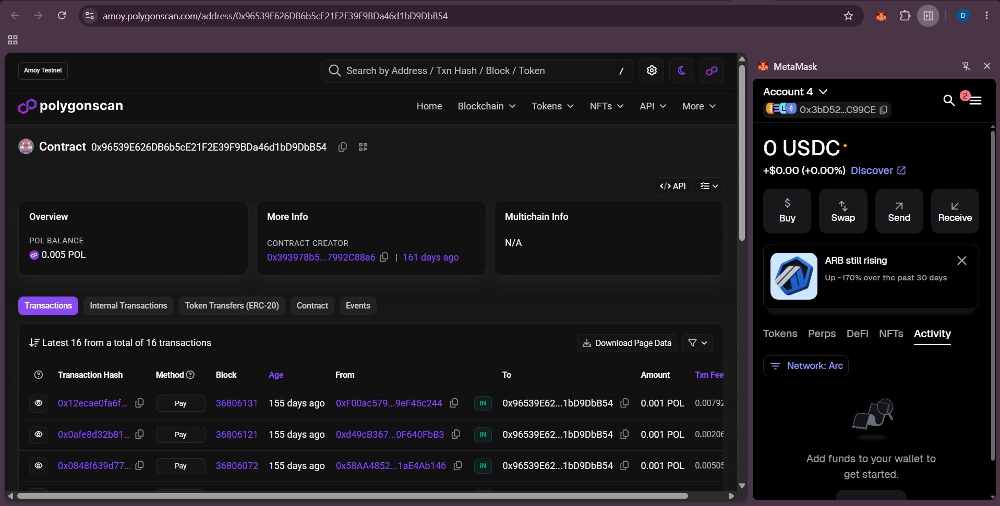

# SmartChit — Blockchain Chit Fund

> India's first trustless chit fund. No organizer controls your money. No fraud possible. Every rupee tracked on blockchain.


**🔗 Live Demo:** (https://chit-fund-blockchain.netlify.app/))

---

## The Problem

India's **₹50,000 Crore** chit fund industry is riddled with fraud:

- **3 Crore+** victims lose money every year to chit fund scams
- Organisers run away with pooled money
- No transparency — members blindly trust the manager
- Legal remedies take years; money is gone forever

**SmartChit eliminates trust** by replacing the human organizer with a smart contract.

---

## Demo

### Live on Polygon — On-Chain Verification


---

## How It Works

```
┌─────────────────────────────────────────────────────────┐
│                    MONTHLY CYCLE                         │
├─────────────────────────────────────────────────────────┤
│                                                         │
│  1. JOIN          2. PAY           3. AUCTION           │
│  ────────         ──────           ─────────            │
│  Members join     Each pays        If all 5 pay,        │
│  the fund (max    1 POL monthly    auction opens        │
│  5 members)       to contract      with countdown       │
│                                                         │
│  4. BID           5. WIN           6. REPEAT            │
│  ─────            ──────           ───────              │
│  Members bid      Lowest bidder    Winner gets pot,     │
│  discounts on     wins the pot     cycle repeats        │
│  the pot          minus discount   for next month       │
│                                                         │
└─────────────────────────────────────────────────────────┘
```

### Step-by-Step

1. **Connect MetaMask** → Polygon Amoy Testnet (chain ID: 80002)
2. **Join Fund** → Call `join()` on the smart contract (gas only)
3. **Pay Contribution** → Send 1 POL monthly via `pay()`
4. **Auction Opens** → When all 5 members pay, auction starts with timer
5. **Place Bids** → Members bid discount amounts (e.g., 0.001 POL)
6. **Winner Declared** → Lowest bidder wins the pot minus their discount
7. **Verify Everything** → All transactions visible on Polygonscan

---

## Security: Why CEO Cannot Steal

| Threat | Protection |
|--------|------------|
| CEO withdraws funds | **No `withdrawAllFunds()` function exists** in the contract |
| Contract code changed | **Immutable** — deployed code cannot be modified |
| Hidden transactions | **Public ledger** — all movements on Polygonscan |
| Manual fund release | **Automatic distribution** — no human approval needed |
| Fake member entries | **On-chain verification** — only wallet addresses join |

> **Proof:** Try calling `withdrawAllFunds()` — it fails. Your money is protected by math, not trust.

---

## Tech Stack

| Layer | Technology |
|-------|-----------|
| **Smart Contract** | Solidity 0.8.20 |
| **Blockchain** | Polygon Amoy Testnet |
| **Development** | Hardhat |
| **Frontend** | HTML5, CSS3, Vanilla JS |
| **Wallet** | MetaMask (ethers.js v6) |
| **Price Feed** | CoinGecko API (POL/INR) |
| **Deployment** | Vercel |

---

## Project Structure

```
Chit-fund-Blockchain/
├── contracts/
│   └── MyToken.sol          # ERC-20 token contract
├── scripts/
│   └── deploy.js            # Deployment script
├── test/
│   └── MyToken.test.js      # Unit tests
├── screenshots/             # Demo screenshots
│   └── 06-live-polygon.png
├── index.html               # Main UI — hero, dashboard, auction
├── app.js                   # Blockchain interaction & wallet logic
├── style.css                # Dark theme with gold accents
├── hardhat.config.js        # Hardhat configuration
├── vercel.json              # Vercel deployment config
├── package.json             # Node dependencies
├── .gitignore               # Git ignore rules
├── LICENSE                  # MIT License
└── README.md                # This file
```

---

## Smart Contract Details

**Deployed Address:** `0x96539E626DB6b5cE21F2E39F9BDa46d1bD9DbB54`

### Key Functions

| Function | Description |
|----------|-------------|
| `join()` | Join the chit fund (max 5 members) |
| `pay()` | Pay monthly contribution (1 POL) |
| `placeBid(discountAmount)` | Place bid for auction discount |
| `endAuction()` | End auction & select winner |
| `getMembers()` | List all members |
| `hasPaid(address)` | Check if member paid this month |
| `totalPot()` | Get current pot balance |
| `auctionActive()` | Check if auction is running |

### Events

| Event | Emitted When |
|-------|-------------|
| `Joined` | New member joins |
| `Paid` | Member pays contribution |
| `BidPlaced` | Member places auction bid |
| `WinnerSelected` | Auction winner declared |
| `DividendPaid` | Winner receives funds |

---

## Getting Started

### Prerequisites

- [Node.js](https://nodejs.org/) v16+
- [MetaMask](https://metamask.io/) browser extension
- Polygon Amoy Testnet tokens ([faucet](https://faucet.polygon.technology/))

### Installation

```bash
# Clone the repository
git clone https://github.com/Jadav-Divyaraj/Chit-fund-Blockchain.git
cd Chit-fund-Blockchain

# Install dependencies
npm install

# Run tests
npx hardhat test

# Compile contracts
npx hardhat compile
```

### Run Frontend Locally

```bash
# Using Python
python -m http.server 3000

# Or using Node.js
npx serve .

# Then open http://localhost:3000
```

### Deploy to Vercel

```bash
# Install Vercel CLI
npm i -g vercel

# Login to Vercel
vercel login

# Deploy
vercel

# Deploy to production
vercel --prod
```

Or connect your GitHub repo to [vercel.com](https://vercel.com) for automatic deployments.

### Deploy Contract

```bash
# Deploy to Polygon Amoy Testnet
npx hardhat run scripts/deploy.js --network amoy
```

---

## Frontend Features

- **Live POL Price** — Real-time POL/INR conversion via CoinGecko API
- **Wallet Integration** — Connect MetaMask, show balance & address
- **Dashboard** — Members count, current month, total pot, user status
- **Auction UI** — Countdown timer, bid input, live bid list
- **Security Demo** — Simulate CEO theft attempt (it fails!)
- **Responsive Design** — Works on desktop and mobile
- **Toast Notifications** — Real-time transaction feedback

---

## Tests

```bash
npx hardhat test
```

```
MyToken
  ✔ has correct name and symbol and initial supply
  ✔ allows transfers
  ✔ owner can mint, others cannot

3 passing
```

---

## Useful Links

- [Live Demo](https://chit-fund-blockchain.vercel.app)
- [Polygonscan (Contract)](https://amoy.polygonscan.com/address/0x96539E626DB6b5cE21F2E39F9BDa46d1bD9DbB54)
- [Polygon Amoy Faucet](https://faucet.polygon.technology/)
- [MetaMask Download](https://metamask.io/)
- [Hardhat Docs](https://hardhat.org/docs)

---

## License

MIT License — feel free to use and modify.

---

Built with a vision to make financial systems transparent and trustless.
