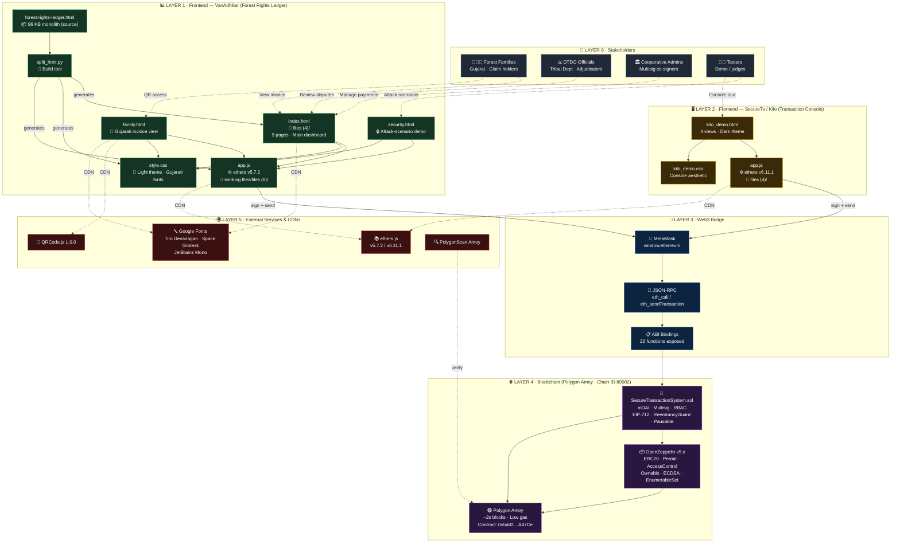
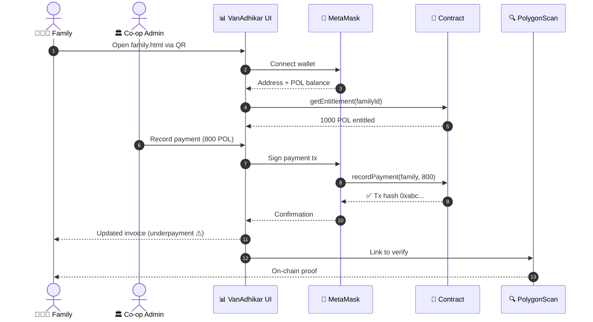
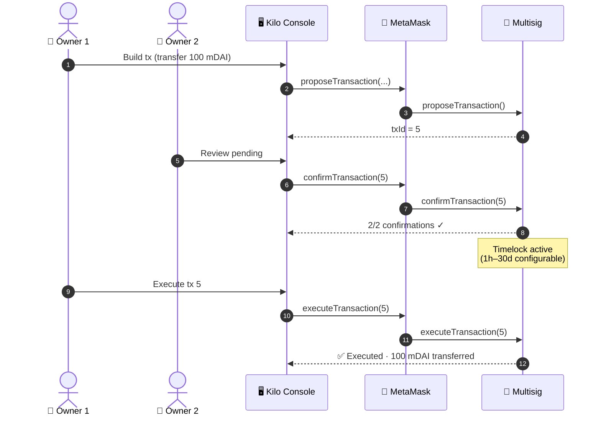
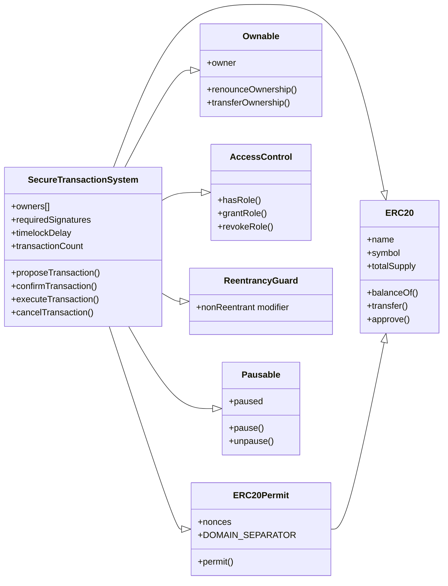

# VanAdhikar Chain — System Architecture (TS-08)

> Forest Rights Ledger on Polygon Amoy · 2026

A two-app web stack built on a single production-grade Solidity contract, demonstrating immutable community forest rights management for Gujarat.

---

## 🏛️ High-Level Architecture



---

## 🔄 Data Flow — A Family's Payment Journey



---

## 🔄 Data Flow — SecureTx Multisig Transaction



---

## 🧱 Smart Contract Inheritance Tree



---

## 📂 Project Structure

```
TS-08 files/
│
├── architecture.html              ← 🌐 Interactive SVG diagram (open in browser)
├── ARCHITECTURE.md                ← 📝 This file (Mermaid diagrams)
│
├── .qodo/                         (Qodo AI agent config — empty)
│
└── files (4)/
    │
    ├── 🌳 VANADHIKAR (Forest Rights Ledger)
    │   ├── index.html              Main dashboard (9 pages)
    │   ├── family.html             Gujarati invoice view
    │   ├── security.html           Attack-scenario demo
    │   ├── style.css               Light theme · Gujarati fonts
    │   └── (app.js lives in working files/files (6)/)
    │
    ├── 🖥️ KILO / SECURETX (Transaction Console)
    │   ├── kilo_demo.html          Dark-theme console (4 views)
    │   ├── kilo_demo.css           Console aesthetic
    │   └── app.js                  ethers v6.11.1 controller
    │
    ├── 📜 SMART CONTRACT
    │   └── demo_Solidity_nemotorn_Kilo.sol
    │       SecureTransactionSystem (mDAI + Multisig + RBAC)
    │
    ├── 🛠️ BUILD TOOL
    │   └── split_html.py           Splits monolith → index/css/js
    │
    ├── 📦 SOURCE
    │   └── forest-rights-ledger (1).html
    │       96 KB monolithic source
    │
    └── 🗂️ ARCHIVES
        ├── files (4).zip
        └── working files/
            ├── .vscode/settings.json   (Live Server :5501)
            └── files (6)/              (earlier iteration)
                ├── app.js
                ├── family.html
                ├── index.html
                ├── security.html
                └── style.css
```

---

## 🔐 Security Properties (End-to-End)

| Layer | Protection |
|-------|------------|
| Frontend | Input validation, address regex, error toasts |
| Web3 | MetaMask confirmation, signed messages |
| Smart Contract | `ReentrancyGuard`, `Pausable`, `AccessControl` (4 roles), `ECDSA` (EIP-712) |
| Multisig | M-of-N, timelock 1h–30d, cancel-on-demand |
| Token | EIP-2612 permit (gasless approvals), role-gated mint/burn |
| Data | No DELETE / No EDIT functions → on-chain immutability |

---

## 🌐 Network Details

| Item | Value |
|------|-------|
| Network | Polygon Amoy Testnet |
| Chain ID | `80002` |
| Deployed Contract | `0x5a8249c23afCaFb14585f07948Fb9762379A47Ce` |
| RPC | Public Amoy endpoint |
| Explorer | https://amoy.polygonscan.com |
| Block time | ~2 seconds |
| Token | POL (native) + mDAI (ERC-20) |

---

*Generated for TS-08 · VanAdhikar Chain · 2026*
